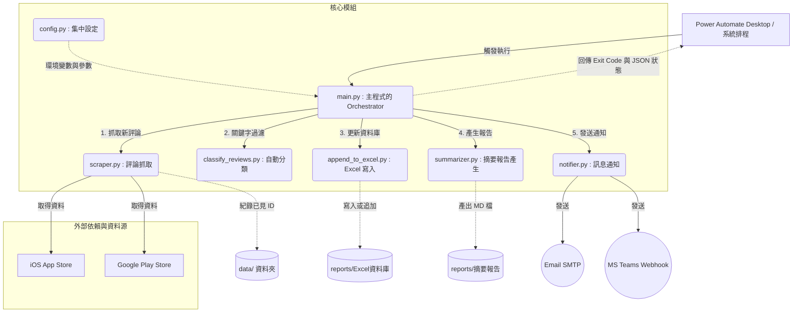

# App 評論監測工具 - 專案架構文件

本文件專為 NotebookLM 或其他 AI 閱讀工具準備，旨在幫助快速理解「App 評論監測工具」的系統架構、元件職責與資料流。

## 1. 專案概述
本專案為一個自動化 Python 應用程式，用於定期監控並抓取指定 App（如：台灣人壽、TeamWalk）在 iOS App Store 與 Google Play 的使用者評論。程式會自動過濾重複評論、進行關鍵字分類、將數據儲存至 Excel 資料庫、產生 Markdown 摘要報告，最後透過 Email 與 Microsoft Teams 發送通知給相關團隊。

設計上考量了與 **Power Automate Desktop (PAD)** 的無縫整合，透過統一的執行結束碼（Exit Code）以及標準化的 JSON 輸出，讓 RPA 系統能準確判斷執行狀態並取得附件路徑。

## 2. 系統架構圖 (Component Architecture)

使用 Mermaid 語法呈現的模組關聯圖：

## 3. 核心執行流程 (Data Flow)

程式主要於 `main.py` 依序執行以下五大步驟：

1. **抓取評論 (Scraper)**：
   - 根據 `config.py` 設定的 App 清單與指定雙平台 ID。
   - `scraper.py` 呼叫 `google_play_scraper` 與 `app_store_scraper`。
   - 透過比對位於 `data/` 目錄下的 `[app]_ios_seen_ids.json` 和 `[app]_android_seen_ids.json` 進行去重，只返回全新的評論。
2. **分類評論 (Classifier)**：
   - 將新抓取的評論根據特定業務規則、關鍵字（實作於 `classify_reviews.py`）進行分類或上標籤。
3. **資料庫更新 (Database)**：
   - 將結構化的評論資料透過 `append_to_excel.py` 寫入至 `reports/App評論監測_資料庫.xlsx`，保留歷史數據供後續分析。
4. **產出摘要 (Summarizer)**：
   - 透過 `summarizer.py` 將當次抓取與分類結果，總結為一份易於閱讀的 Markdown 報表，儲存於 `reports/report_[今日日期].md`。
5. **通知發送 (Notifier)**：
   - `notifier.py` 處理兩種渠道推播：如果 `TEAMS_ENABLED` 開啟，則發送至 Teams Webhook；若 `EMAIL_ENABLED` 開啟，透過 SMTP 寄發通知信（並夾帶/引用生成的摘要）。

## 4. 目錄與檔案說明

| 檔案/目錄名稱 | 說明 |
| --- | --- |
| `main.py` | 專案入口點。控制全域流程（1.抓取 -> 2.分類 -> 3.寫入 Excel -> 4.產生報告 -> 5.通知），並回傳標準化 JSON 以供 PAD 解析。 |
| `config.py` | 集中參數設定檔。透過讀取環境變數載入各類機密配置（如 SMTP 密碼、Teams URL），並定義了 App ID 列表及各平台抓取限制（如 200/50 篇）。 |
| `scraper.py` | 爬蟲模組，負責與 App Store 和 Google Play 溝通。內含機制可將已讀取的評論 ID 存入 JSON 防止重複通知。 |
| `classify_reviews.py` | 針對評論內容執行正/負評分析或關鍵字分類。 |
| `append_to_excel.py` | 處理 Excel 讀寫與追加邏輯的函式集，預防資料遺失或覆寫。 |
| `summarizer.py` | 彙整模組，將陣列形式的評論轉換成結構標題、列表的 Markdown 文字。 |
| `notifier.py` | 發送通知的統籌器，內含發送 Email 及 Teams 訊息的實作邏輯。 |
| `/data/` | 輕量化本地暫存區，主要存放用於追蹤過往評論 ID 的 JSON 檔案 (`*_seen_ids.json`)，做為去重的依據。 |
| `/reports/` | 產出檔案儲存區，包含 Excel 資料庫檔案（持續累積）以及每日或每次執行的 Markdown 摘要報告 (`report_*.md`)，與 PAD 執行結果檔 (`latest_result.json`)。 |

## 5. 與 RPA (Power Automate Desktop) 整合機制

`main.py` 提供特殊的設計以支援 PAD：
1. **防呆回傳碼**：`0` 代表任務完全順利，`1` 代表部分操作（如通知或寫入）失敗但不影響後續，`2` 代表嚴重致命錯誤。
2. **結構化輸出 (\_\_PAD_RESULT__)**：程式執行結束前，會將當下所有產出檔案路徑（包括報告 MD 與 Excel 路徑）、抓取筆數、信件主旨等關鍵資訊匯編成 JSON 格式，並以 `__PAD_RESULT__:{json}` 的格式印於標準輸出的最後一行。PAD 能利用截取 `Stdout` 直接讀取這段 JSON，或從 `reports/latest_result.json` 讀取，再依此進行後續流程分派。

## 6. API 依賴與抓取限制

專案未採用需要官方申請 API Key 的端點，而是使用開源爬蟲套件 (`app_store_scraper` 與 `google_play_scraper`) 來獲取評論：
- **無官方額度限制**：這排除了付費 API 的請求額度問題。
- **平台反爬蟲風險**：短時間大量請求有被 Apple 或 Google 封鎖 IP 的風險。
- **抓取保護機制**：依賴 `config.py` 定義的數量進行增量抓取（預設 Android 一次 `200` 篇、iOS `50` 篇），只抓取最新留言。系統排程上建議降低密集度（例如每日數次即可）以保證長期爬取的穩定性。
