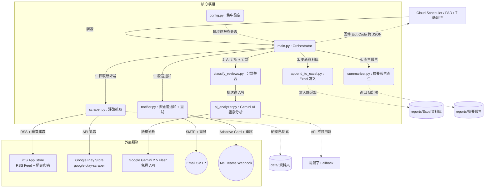

# App 評論監測工具 - 專案架構文件

本文件專為 NotebookLM 或其他 AI 閱讀工具準備，旨在幫助快速理解「App 評論監測工具」的系統架構、元件職責與資料流。

## 1. 專案概述
本專案為一個自動化 Python 應用程式，用於定期監控並抓取指定 App（台灣人壽、TeamWalk）在 iOS App Store 與 Google Play 的使用者評論。程式會自動過濾重複評論、透過 **Google Gemini AI** 進行語意分析與分類、將數據儲存至 Excel 資料庫、產生 Markdown 摘要報告，最後透過 Email 與 Microsoft Teams 發送通知給相關團隊。

設計上考量了兩種部署方式：
- **Windows 本機** + Power Automate Desktop (PAD)：透過統一的 Exit Code 與 JSON 輸出整合 RPA
- **GCP Cloud Functions** + Cloud Scheduler：雲端免費定時執行

## 2. 系統架構圖 (Component Architecture)

使用 Mermaid 語法呈現的模組關聯圖：

## 3. 核心執行流程 (Data Flow)

程式主要於 `main.py` 依序執行以下五大步驟：

1. **抓取評論 (Scraper)**：
   - 根據 `config.py` 設定的 App 清單與雙平台 ID
   - **iOS**：使用 iTunes RSS Feed 抓取評論，並透過 App Store 網頁爬蟲（BeautifulSoup）偵測開發者回覆狀態。若爬蟲被阻擋，回覆狀態標記為「未知」（不過濾）
   - **Android**：使用 `google-play-scraper` 套件，API 直接回傳 `replyContent` 欄位判斷回覆狀態
   - 透過比對 `data/` 目錄下的 `*_seen_ids.json` 進行去重，只返回全新的評論
   - 可設定 `IGNORE_REPLIED_IOS_REVIEWS` / `IGNORE_REPLIED_ANDROID_REVIEWS` 過濾已回覆評論

2. **AI 語意分析 + 分類 (AI Analyzer + Classifier)**：
   - 優先使用 Google Gemini 2.5 Flash（免費方案，每日 1500 次請求）
   - 每批 10 則評論送 Gemini 分析，回傳：分類（程式錯誤/功能建議/UX體驗/帳號問題/效能問題/正面評價/客服問題/其他）、情緒（正面/負面/中性）、優先度（高/中/低）、一句話摘要
   - API 不可用或配額耗盡時，自動 fallback 至內建關鍵字分類引擎
   - Gemini free tier rate limit：每批次間隔 4 秒

3. **資料庫更新 (Database)**：
   - 透過 `append_to_excel.py` 寫入 `reports/App評論監測_資料庫.xlsx`，包含 AI 分析結果欄位
   - 自動去重，保留歷史數據供後續分析

4. **產出摘要 (Summarizer)**：
   - 將當次抓取與分類結果，總結為 Markdown 報表
   - 儲存於 `reports/report_YYYY-MM-DD.md`

5. **通知發送 (Notifier)**：
   - 支援 Email (SMTP) 與 Teams (Adaptive Card) 雙通道
   - 內建指數退避重試機制（預設 3 次：2s → 4s → 8s）
   - 回溯模式不發通知，避免歷史評論灌爆

## 4. 目錄與檔案說明

| 檔案/目錄名稱 | 說明 |
| --- | --- |
| `main.py` | 專案入口點。控制全域流程（抓取 → AI 分析 → 分類 → Excel → 報告 → 通知），含 GCP Cloud Functions HTTP handler，並回傳標準化 JSON 以供 PAD 解析。Windows 環境自動設定 UTF-8 輸出避免亂碼。 |
| `config.py` | 集中參數設定檔。透過 `python-dotenv` 讀取 `.env` 檔案載入機密配置，定義 App 清單、抓取限制、AI 設定、通知重試設定。自動偵測 GCP 環境切換路徑（`/tmp`）。 |
| `scraper.py` | 爬蟲模組。iOS 使用 RSS Feed + 網頁爬蟲偵測回覆；Android 使用 `google-play-scraper`。內含 seen_ids 去重機制。支援回溯模式抓取歷史評論。 |
| `ai_analyzer.py` | AI 語意分析模組。使用 Google Gemini 2.5 Flash 免費 API 批次分析評論，回傳分類/情緒/優先度/摘要。含關鍵字 fallback 機制。 |
| `classify_reviews.py` | 分類整合模組。串接 AI 分析與關鍵字分類，統一對外介面。 |
| `append_to_excel.py` | Excel 讀寫與追加邏輯，自動去重防止資料遺失。 |
| `summarizer.py` | 彙整模組，將評論轉換為結構化 Markdown 報表。 |
| `notifier.py` | 多通道通知統籌器。採用 ABC 抽象基底類別設計（EmailChannel + TeamsChannel），NotificationManager 統一管理，含指數退避重試裝飾器。 |
| `.env` / `.env.example` | 環境變數檔案。包含 SMTP 設定、Teams Webhook URL、Gemini API Key 等機密資訊。 |
| `requirements.txt` | Python 依賴清單：google-play-scraper、google-generativeai、beautifulsoup4、pandas、openpyxl、requests、python-dotenv、functions-framework。 |
| `deploy_gcp.sh` | GCP Cloud Functions 一鍵部署腳本。 |
| `/data/` | 輕量化本地暫存區，存放 `*_seen_ids.json` 做為去重依據。 |
| `/reports/` | 產出檔案區，包含 Excel 資料庫、每日 Markdown 報告、`latest_result.json`。 |

## 5. 部署架構

### 方式 A：Windows 本機 + PAD
- `main.py` 提供 Exit Code（0/1/2）與 `__PAD_RESULT__` JSON 輸出
- PAD 透過「執行 DOS 指令」觸發，讀取 `reports/latest_result.json` 判斷結果
- 適合已有 Windows 工作站的環境

### 方式 B：GCP Cloud Functions + Cloud Scheduler
- `main.py` 包含 `cloud_function_handler()` HTTP 入口
- Cloud Scheduler 每日定時發送 HTTP 請求觸發
- GCP 免費額度內零成本運行
- 環境變數透過 `--set-env-vars` 傳入

## 6. API 依賴與限制

| 服務 | 用途 | 限制 |
| --- | --- | --- |
| iTunes RSS Feed | iOS 評論抓取 | 無官方限制，但頻繁請求可能被暫時封鎖 |
| App Store 網頁 | iOS 回覆偵測 | Apple 可能阻擋爬蟲，失敗時 graceful degradation |
| google-play-scraper | Android 評論抓取 | 非官方 API，短時間大量請求有封鎖風險 |
| Google Gemini 2.5 Flash | AI 語意分析 | 免費方案：每日 1500 次請求、每分鐘 15 次、100 萬 tokens/日 |
| Gmail SMTP | Email 通知 | 需使用 App 密碼，每日 500 封 |
| Teams Webhook | Teams 通知 | 無明確限制 |
