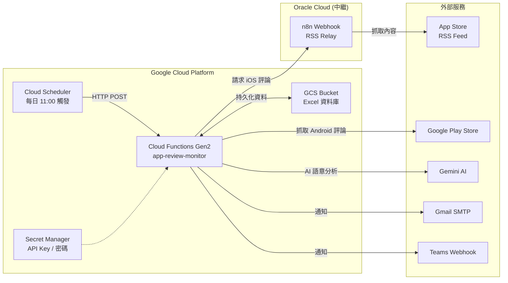

# App 評論監測工具：GCP 雲端部署手冊

本手冊指導您如何將 App 評論監測工具部署至 **Google Cloud Platform (GCP)**，使用 **Cloud Functions (Gen2)** + **Cloud Scheduler** 實現每日自動執行。

---

## 架構圖



---

## 1. 前置準備

### 1.1 安裝 Google Cloud SDK
前往 [gcloud CLI 安裝頁面](https://cloud.google.com/sdk/docs/install) 下載並安裝。

### 1.2 登入並設定專案
```bash
gcloud auth login
gcloud config set project YOUR_PROJECT_ID
```

### 1.3 啟用必要 API
```bash
gcloud services enable \
  cloudfunctions.googleapis.com \
  cloudscheduler.googleapis.com \
  cloudbuild.googleapis.com \
  run.googleapis.com \
  secretmanager.googleapis.com \
  storage.googleapis.com
```

---

## 2. iOS 中繼設定 (自建 Proxy)
由於 Apple 封鎖了 GCP 的 IP 網段，雲端部署**必須**配合中繼 Proxy 才能抓取 iOS 評論。

### 2.1 在 n8n 匯入工作流
1. 使用本專案提供的 `n8n_ios_rss_relay.json` 檔案。
2. 匯入至你的 n8n 並設定 Webhook 密鑰 (X-API-Key)。
3. 啟動 (Active) 該工作流。

---

## 3. 部署 Cloud Function

### 方法 A：使用部署腳本（推薦）
修改 `deploy_gcp.sh` 中的環境變數後執行：
```bash
bash deploy_gcp.sh
```

### 方法 B：手動部署
```bash
gcloud functions deploy app-review-monitor \
  --gen2 \
  --region=asia-east1 \
  --runtime=python312 \
  --memory=512MB \
  --timeout=540s \
  --entry-point=cloud_function_handler \
  --trigger-http \
  --allow-unauthenticated \
  --set-env-vars="EMAIL_SMTP_SERVER=smtp.gmail.com,EMAIL_SMTP_PORT=587,EMAIL_SENDER=your@gmail.com,EMAIL_PASSWORD=your-app-password,EMAIL_RECIPIENTS=pm@company.com,TEAMS_WEBHOOK_URL=https://...webhook.office.com/...,GEMINI_API_KEY=your-gemini-key" \
  --source=.
```

部署成功後會回傳一個 HTTP URL，例如：
```
https://asia-east1-YOUR_PROJECT.cloudfunctions.net/app-review-monitor
```

---

## 3. 設定 Cloud Scheduler

建立每日定時觸發排程：
```bash
gcloud scheduler jobs create http app-review-daily \
  --location=asia-east1 \
  --schedule="0 11 * * *" \
  --time-zone="Asia/Taipei" \
  --uri="https://asia-east1-YOUR_PROJECT.cloudfunctions.net/app-review-monitor" \
  --http-method=POST
```

> 此設定為每天早上 11:00 (台灣時間) 自動執行一次。

### 手動測試觸發
```bash
gcloud scheduler jobs run app-review-daily --location=asia-east1
```

---

## 4. 費用估算

在 GCP 免費額度內，本工具可完全免費運行：

| 服務 | 免費額度 | 本工具用量 |
|:---|:---|:---|
| Cloud Functions | 200 萬次調用/月 | ~30 次/月 |
| Cloud Scheduler | 3 個 job 免費 | 1 個 job |
| Cloud Build | 120 分鐘/天 | ~2 分鐘/次部署 |
| Cloud Storage (GCS) | 5 GB/月（美國區免費） | < 1 MB |
| Secret Manager | 6 個 secret 版本免費 | 4 個 secret |
| 出站流量 | 1 GB/月 | 極少 |

---

## 5. 注意事項

- **GCP 環境下**，`config.py` 會自動偵測 `FUNCTION_TARGET` 環境變數，將資料目錄切換至 `/tmp`（Cloud Functions 唯一可寫入的目錄）
- **資料持久化**：`storage.py` 會在啟動時從 GCS Bucket 下載 `seen_ids.json` 與 `Excel 資料庫` 到 `/tmp`，執行完畢後再上傳回 GCS，確保資料不會因冷啟動消失
- **Cold Start 增量保護**：若 GCS 中找不到 `seen_ids.json`（首次部署），程式會自動限制只抓近 2 天評論，避免超過 540s 執行上限
- **Email 附件**：每日通知 Email 會自動附帶最新的 Excel 資料庫檔案（`App評論監測_資料庫.xlsx`）
- **搬到 PAD**：`storage.py` 會自動偵測環境。在本機 / PAD 上直接使用本地檔案系統，不需要修改任何程式碼
- Gemini API Key 建議從 [Google AI Studio](https://aistudio.google.com/apikey) 取得（有免費額度）

---

## 6. 常見問題

**Q: 部署時出現 Build failed with missing permission？**
A: 執行以下指令授予 Build Service Account 權限：
```bash
PROJECT_NUMBER=$(gcloud projects describe YOUR_PROJECT --format="value(projectNumber)")
gcloud projects add-iam-policy-binding YOUR_PROJECT \
  --member="serviceAccount:${PROJECT_NUMBER}@cloudbuild.gserviceaccount.com" \
  --role="roles/cloudbuild.builds.builder"
gcloud projects add-iam-policy-binding YOUR_PROJECT \
  --member="serviceAccount:${PROJECT_NUMBER}@cloudbuild.gserviceaccount.com" \
  --role="roles/artifactregistry.writer"
```

**Q: 如何查看執行日誌？**
A:
```bash
gcloud functions logs read app-review-monitor --region=asia-east1 --limit=50
```
